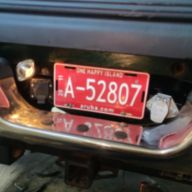

Licence plate mount for 2nd Gen dodge truck.

Allows for mounting trailer plug above bumper for better plug protection. Allows for install of 7 pin round heavy duty plug in addition to 7 pin flat.

Dxf and FreeCad files attatched.

Cut main from 1/8 or 3/16 steel. Cut light mount and braces from 1/8.

Video:
https://studio.youtube.com/video/Uf6wLgGlJbI/edit
Dxf's only
https://www.langmuirsystems.com/fireshare/2nd-gen-dodge-licence-plate-mount#comment-4292